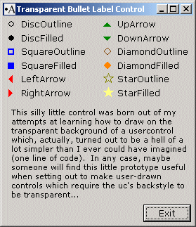

<div align="center">

## Transparent Bullet Label Control


</div>

### Description

A small prototype of a much larger project I am working on which required the use of labels with a little more zest. Hence, my solution is tranparent bullet labels. This project demonstrates a simple way to draw text, shapes, etc., on a usercontrol when the backstyle is set to transparent and should be useful as a starting point for anyone wanting to roll their own transparent controls with the added flexibility of drawing it yourself.
 
### More Info
 


<span>             |<span>
---                |---
**Submitted On**   |2004-09-27 15:04:44
**By**             |[AlT](https://github.com/Planet-Source-Code/PSCIndex/blob/master/ByAuthor/alt.md)
**Level**          |Intermediate
**User Rating**    |5.0 (25 globes from 5 users)
**Compatibility**  |VB 6\.0
**Category**       |[Custom Controls/ Forms/  Menus](https://github.com/Planet-Source-Code/PSCIndex/blob/master/ByCategory/custom-controls-forms-menus__1-4.md)
**World**          |[Visual Basic](https://github.com/Planet-Source-Code/PSCIndex/blob/master/ByWorld/visual-basic.md)
**Archive File**   |[Transparen1798139272004\.zip](https://github.com/Planet-Source-Code/alt-transparent-bullet-label-control__1-56381/archive/master.zip)

### API Declarations

```
Private Declare Function CreateBrushIndirect Lib "gdi32" (lpLogBrush As LOGBRUSH) As Long
Private Declare Function CreatePen Lib "gdi32" (ByVal nPenStyle As Long, _
   ByVal nWidth As Long, ByVal crColor As Long) As Long
Private Declare Function DeleteObject Lib "gdi32" (ByVal hObject As Long) As Long
Private Declare Function DrawTextEx Lib "user32" Alias "DrawTextExA" (ByVal hdc As Long, _
   ByVal lpsz As String, ByVal n As Long, lpRect As RECT, ByVal un As Long, _
   ByVal lpDrawTextParams As Any) As Long
Private Declare Function Ellipse Lib "gdi32" (ByVal hdc As Long, ByVal X1 As Long, _
   ByVal Y1 As Long, ByVal X2 As Long, ByVal Y2 As Long) As Long
Private Declare Function GetSysColor Lib "user32" (ByVal nIndex As Long) As Long
Private Declare Function Polygon Lib "gdi32" (ByVal hdc As Long, lpPoint As POINTAPI, _
   ByVal nCount As Long) As Long
Private Declare Function Rectangle Lib "gdi32" (ByVal hdc As Long, ByVal X1 As Long, _
   ByVal Y1 As Long, ByVal X2 As Long, ByVal Y2 As Long) As Long
Private Declare Function SelectObject Lib "gdi32" (ByVal hdc As Long, _
   ByVal hObject As Long) As Long
```


